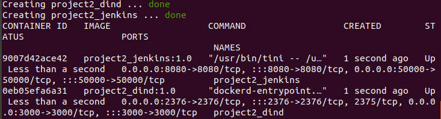
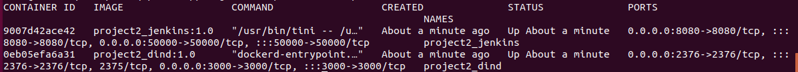

### 1. Start

setup and run container:

```sh
./project2_start.sh
```

Wait a few minutes, you will see:



This indicates that the containers were successfully built. then run:

```sh
docker ps
```

If all are right, you should see similar output with below:



### 2. Stop

shutdown and clean container by run:

```sh
./project2_shutdown.sh
```

It will stop all containers and clean the images built before.